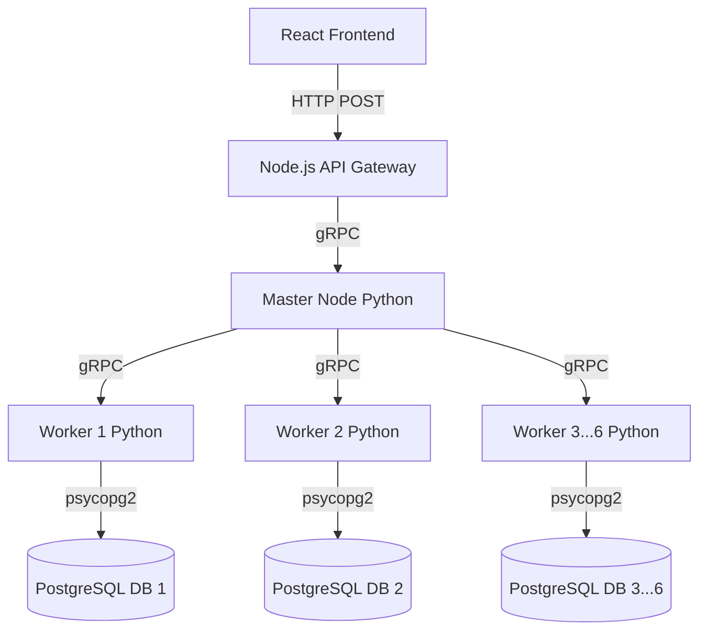

# Distributed Query Processing Engine

A custom-built, highly concurrent distributed database query engine demonstrating advanced distributed systems concepts like data sharding, map-reduce aggregations, and in-memory hash joins. It features a Master-Worker topology over PostgreSQL, utilizing a robust Python gRPC networking layer, an Abstract Syntax Tree (AST) query planner, and a modern React frontend.

## 🚀 Key Features

*   **Distributed Architecture:** A Master node orchestrates query planning and routes SQL execution across 6 independent PostgreSQL Worker partitions (Sharding).
*   **AST Query Parser:** Utilizes `sqlglot` to parse raw SQL strings into Abstract Syntax Trees, enabling intelligent query routing based on partition keys (e.g., date-based hashing, region matching).
*   **Enterprise-Grade Security:** Complete protection against SQL injection. The Master node parameterizes queries and passes AST-extracted values via gRPC payload for native Postgres binding at the worker level.
*   **gRPC Authentication:** Internal microservice communication between Master and Workers is secured via Token Interceptors.
*   **Map-Reduce Aggregations & Joins:** Implements map-reduce for distributed aggregates (`COUNT`, `SUM`, `AVG`) and an in-memory hash join algorithm for combining partitioned datasets on the Master node.
*   **Graceful Fault Tolerance:** Worker network partitions and offline nodes are caught gracefully, returning `HTTP 503` statuses instead of crashing the orchestration engine.

## 🏗️ Architecture



### Tech Stack
*   **Core Engine:** Python 3.12, gRPC, Protobuf, `sqlglot`
*   **Storage Layer:** PostgreSQL 16
*   **Frontend:** React, TailwindCSS, Framer Motion
*   **Infrastructure:** Docker Compose

## 📊 Performance Benchmarks

In local distributed emulation via Docker networks, the engine achieves significant speedups by pushing computation to the data nodes (Workers) rather than pulling raw data to a centralized client for processing.

**Benchmark Test:** Complex Distributed Hash Join (`sales` JOIN `customers` + `ORDER BY`)
*   **Distributed Execution Time:** `0.8281 seconds`
*   **Estimated Centralized (Legacy) Transfer Time:** `2.0703 seconds`
*   **Speedup Factor:** `2.50x`

*(Benchmark conducted locally via `benchmark.py` running against 6 active containerized Postgres partitions).*

## 🛠️ Running the Project

### 1. Start the Distributed Cluster
The entire distributed backend (Master, 6 Workers, 6 Postgres instances) is containerized.
```bash
docker-compose up -d --build
```
*Wait approximately 30 seconds for all PostgreSQL instances to initialize and become healthy.*

### 2. Run the Benchmark Tests
To verify cluster health and performance:
```bash
python benchmark.py
```

### 3. Start the UI (Optional)
To interact with the engine visually:
```bash
cd client/dqps_frontend
npm install
npm run dev
```
